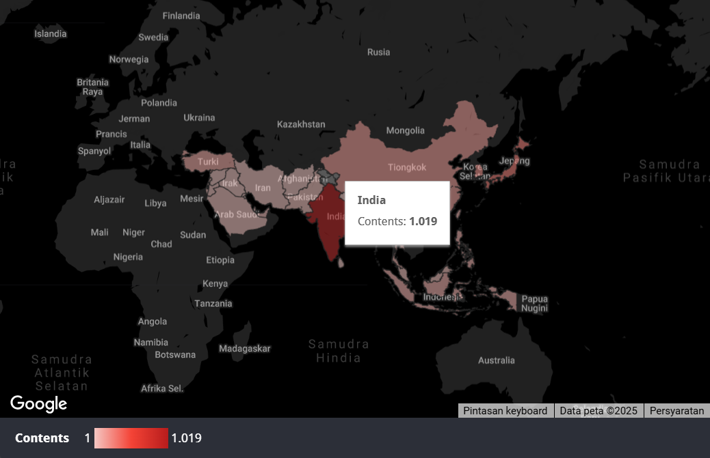
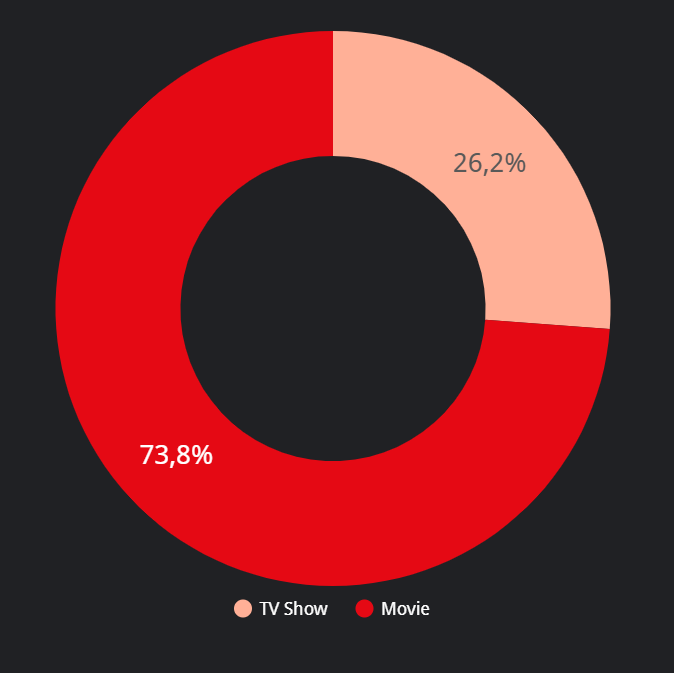
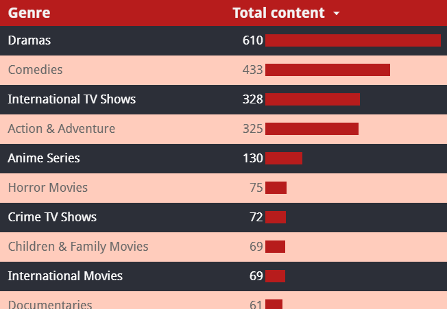
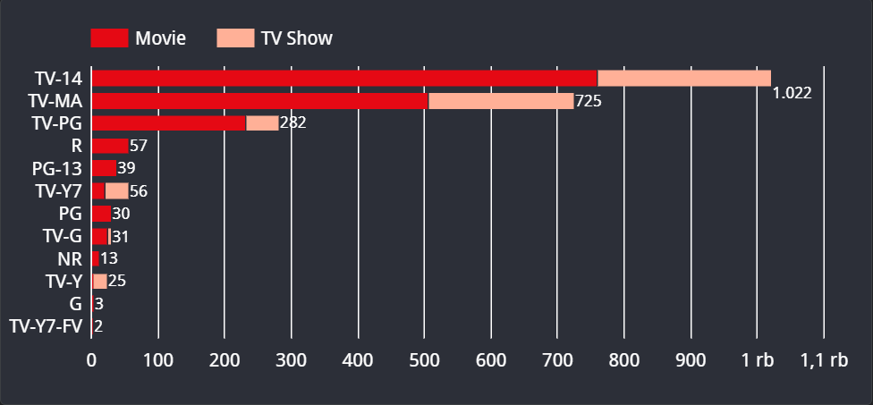

# Analysis of Content Type and Genre that Affect Ratings on Netflix in Asia countries

## Background
Netflix adalah platform streaming yang menyediakan berbagai pilihan hiburan, mulai dari acara TV pemenang penghargaan, film, anime, dokumenter, dan banyak lagi yang dapat diakses melalui berbagai perangkat yang terhubung ke internet. Layanan ini digunakan di hampir seluruh dunia, termasuk di Asia. Netflix mulai melebarkan sayapnya di Asia dengan meluncurkan layanan di Jepang pada 2 September 2015. Asia dikenal dengan keberagaman budaya yang kuat dan nilai-nilai tradisional yang dijunjung tinggi. Sebagai contoh, di kawasan Asia Barat, seperti Arab Saudi, tayangan acara TV dan film yang disiarkan harus mematuhi norma dan prinsip agama mayoritas Islam yang berlaku di negara tersebut.

*Factor*
- Preferensi budaya
- Peran institusi
- Hubungan antar individu

Secara sederhana, setiap film atau acara TV yang diputar di Netflix juga disertai dengan rating yang dirancang untuk mengklasifikasikan audiens, guna memastikan konten yang ditawarkan sesuai dengan beragam preferensi dan kebutuhan negara, terutama di Asia.

---

## Project Goals 🎵
*Objectives*
Memprediksi rilisnya konten Netflix, baik berupa Movie maupun acara TV, beserta rating yang tersebar di Asia berdasarkan data yang terkumpul. Tujuannya adalah untuk menghasilkan wawasan dan rekomendasi yang dapat digunakan dalam merancang strategi bisnis dan pemasaran.

*Scope*
- Laporan perilisan konten Netflix di Asia selama lima tahun terakhir (`2017-2021`).
- Laporan perilisan konten Netflix dari tipe konten (`Movie` dan `TV Show`), genre, dan rating yang terdapat dalam Netflix.

---

## Research Question & Methodology
### Research Question
- Tipe konten apa yang lebih banyak rilis di Asia?
- Negara apa yang memiliki konten terbanyak dalam tahun 2017-2021?
- Genre apa yang lebih populer di Asia?

### Methodology
Kami menggunakan metode sistematis yang dipakai untuk menemukan solusi dalam sebuah masalah penelitian melalui pengumpulan data, pembersihan, analisis, dan visualisasi.

1. Pertama kami mencari dan mengetahui `Problems` yang ingin kami angkat dari layanan Netflix.
2. Pada tahap `Data Gathering` kami mengumpulkan dataset dari Kaggle.
3. Selanjutnya kami melakukan `Data Cleaning` dengan menggunakan Google Spreadsheet dan berkolaborasi dengan Google BigQuery untuk mengetahui scope yang kami ambil.
4. Lalu kami melakukan `Data Analysis` dengan metode EDA untuk mencapai tujuan research question kami dengan Google Spreadsheet.
5. Selanjutnya pada tahap `Data Visualization` kami menggunakan Looker Studio yang dimana sekaligus kami menentukan `Insight & Recommendation` yang akan kami berikan.

Untuk proses `Data Cleaning` dan `Data Analysis`, dapat dilihat melalui tautan berikut : 

---

## About Dataset 📂
Dataset yang kami dapat berjudul Netflix `Movies` and `TV Shows`

Dataset ini terdiri dari berbagai macam film dari Movie ataupun TV Show yang rilis di banyak negara dari tahun 2012 sampai 2021 serta memiliki detail informasi dari film-film tersebut seperti judul, director, cast, release year, rating, durasi, genre dan deskripsi film. Dataset tersedia untuk diunduh melalui tautan berikut : 

---

## Data Analysis & Visualization 📈
Dashboard `Visualization` dapat dilihat melalui tautan berikut : 

Selanjutnya. Berikut adalah penjelasan dashboard yang telah kami buat terdiri atas score card, filter, dan beberapa chart.

### Teks Analisis Overview
- Terdapat 28 countries di Asia yang memiliki perilisan konten di netflix
- Terdapat 12 jenis rating di Asia
- Tipe konten movie di Asia berjumlah 1687
- Tipe konten TV show di Asia berjumlah 622

### Demographics (Demografis negara-negara di Asia yang memiliki perilisan di netflix)

Dari  28 countries di Asia, India menjadi negara yang memiliki perilisan konten terbanyak di Netflix dengan total 1019 konten.

### Content Type Comparison (Komparasi Tipe Konten)

Tipe konten movie mengambil persentase sebesar 73,8%, sedangkan TV show hanya 26,2%, sehingga movie menjadi tipe konten terbanyak di Asia. Artinya Movie sangat diminati di Asia.

### Total Ratings of Content Types (Total Rating dati Tipe Konten)

Berikut adalah 12 jenis rating yang ada di Asia. Rating terbanyak di Asia adalah TV-14 (tidak cocok untuk anak usia dibawah 14 tahun) dengan Movie sebagai tipe konten terbanyak. Hal ini juga berhubungan dengan rata-rata pengguna Netflix di Asia yang dimana penggunanya berada di klasifikasi remaja ke atas.

### Various Content Genre (Variasi Genre konten)

Berikut adalah top 10 genre konten terbanyak di Asia dalam 5 tahun kebelakang (2017-2021), Drama berada di peringkat pertama diikuti Komedi, Action & Adventure, International TV Show, dan Anime Series. 

---

## Conclusion & Recommendations 📋
### Insight
- `Movie` menjadi tipe konten yang lebih banyak rilis di Asia untuk 5 tahun terakhir (2017-2021) berdasarkan perilisan konten terbanyak.
- Negara terbanyak yang mendapatkan konten dari Netflix adalah `India` dengan `Movie` sebagai tipe konten terbanyak.
- Top 5 genre terbanyak yang rilis di Asia adalah `Drama`, `Komedi`, `Action & Adventure`, `International TV Show`, dan `Seri Anime`.

### Business Problem Answer / Recommendations
1. Melakukan analisis pasar dan bekerja sama dengan Netflix business team untuk mencapai standar rilis yang konsisten di Asia. Seperti dengan rating yang tertera di konten tersebut, Netflix juga harus mengklasifikasikan dari demografi penonton berdasarkan rating konten tersebut.

2. Meningkatkan kepuasan pelanggan dengan:
- Memproduksi konten yang menyesuaikan preferensi dan budaya.
Contoh, seperti menerima feedback dari pengguna Netflix kira-kira konten Movie atau TV Show apa yang ingin ada di Netflix. Kalau konten budaya dari Movie ataupun TV Show sekiranya apa saja yang ingin rilis di Netflix melalui feedback dari pengguna-penggunanya.
- Menyediakan pilihan bahasa.
- Responsif terhadap konten yang dianggap sensitif agar fleksibel dalam perilisan konten.
Fleksibel seperti pemberian pop-up window warning dan sensor pada konten jika demografi pengguna tidak sesuai dengan rating konten tersebut.

3. Melakukan analisis penonton, melakukan interaksi dengan penonton sebelum perilisan, dan bekerja sama dengan Netflix data analysis dan production team untuk menyesuaikan waktu perilisan dengan kebiasaan pengguna guna meningkatkan kontribusi pada perilisan konten.
Contoh, seperti memiliki komunitas dan mengukurnya lewat survey pengguna Netflix (hampir sama dengan feedback dari pengguna).

---

## Kontribusi 🤝
Kontribusi sangat disambut! Silakan buat pull request untuk penambahan fitur atau perbaikan bug.

---

## Lisensi 📜
Proyek ini dilisensikan di bawah MIT License.
